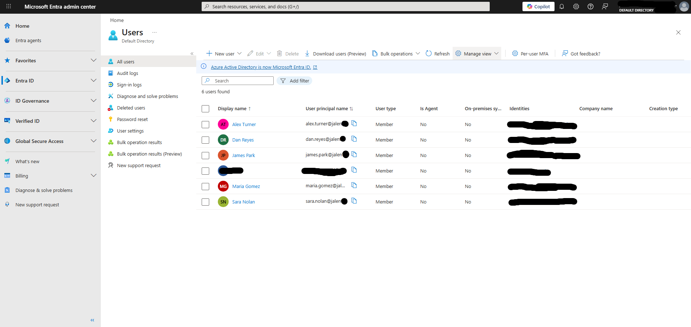
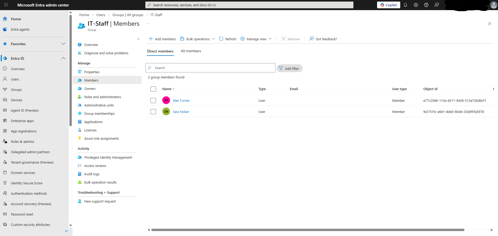
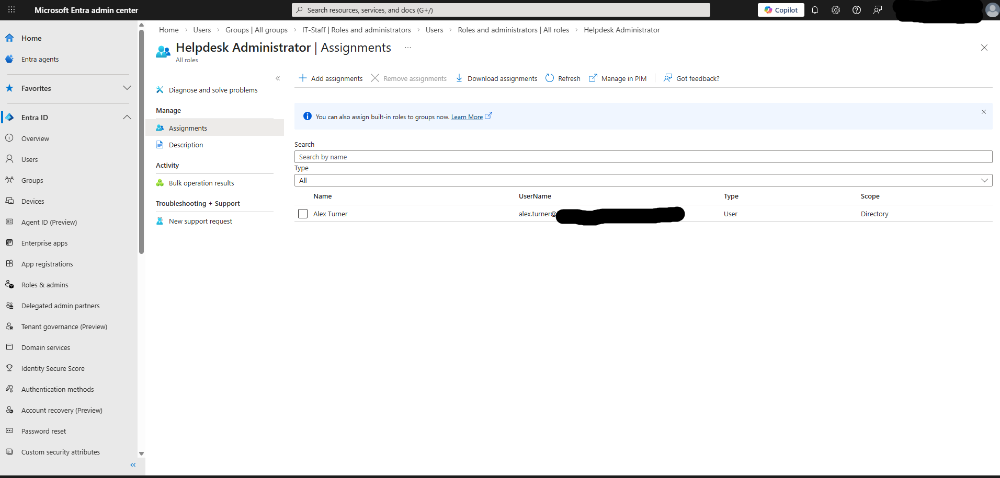

# Lab 1 — Users, Groups & RBAC in Entra ID

## Objective
Practice creating and managing user identities, groups, and role assignments in Microsoft Entra ID to simulate a real enterprise IAM environment.

## Environment
- Microsoft Entra ID Free tier
- Personal lab tenant: jalenthomas1216gmail.onmicrosoft.com

## What I did

### Users created
- Created 5 test users across IT, HR, Finance, and Security departments
- Set Department and Job Title attributes on each user

### Groups created
- IT-Staff (Security group, manual membership)
- HR-Finance-Collab (Microsoft 365 group)

### RBAC assignments
- Assigned Helpdesk Administrator directly to Alex Turner
- Assigned Security Reader to IT-Staff group
- Tested access by logging in as each user in a private browser window

## What I observed
- Direct role assignment gives immediate access
- Group-based role assignment — removing a user from the group instantly revokes the inherited role
- Helpdesk Administrator could reset passwords but could not modify roles or access security settings
- Department and Job Title attributes are critical for dynamic group rules

## Skills demonstrated
- User lifecycle management
- Group-based access control
- RBAC role assignment (direct and group-based)
- Principle of least privilege
- Identity attribute management

## Tools used
- Microsoft Entra ID
- Microsoft 365 Admin Center

## Screenshots

