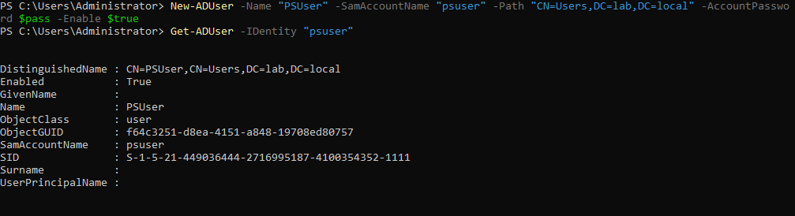
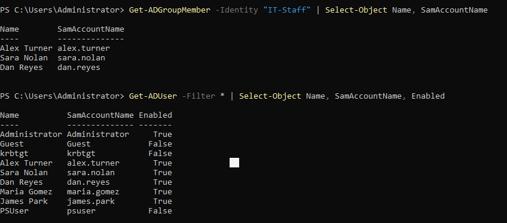

# Lab 10 — Active Directory PowerShell Automation

## Objective
Use PowerShell to manage Active Directory users and groups 
programmatically, simulating real enterprise IAM automation 
on an on-premises domain.

## Environment
- Windows Server 2022 Standard Evaluation
- Active Directory Domain: lab.local
- PowerShell 5.1 with ActiveDirectory module

## What I did

### User management via PowerShell
- Created a new AD user in the Users container
- Verified user creation with Get-ADUser
- Disabled the user account with Disable-ADAccount
- Confirmed disabled status by querying Enabled property

### Group management
- Queried IT-Staff group members using Get-ADGroupMember
- Retrieved all domain users with Get-ADUser -Filter *

### Troubleshooting
- Resolved "server unwilling to process request" error
  by using CN=Users path instead of OU=IT
- Learned that password complexity policy affects 
  programmatic user creation the same as manual creation

## Commands used

### Create a user
```powershell
$pass = ConvertTo-SecureString "Lab@Admin2026!!" -AsPlainText -Force
New-ADUser -Name "PSUser" -SamAccountName "psuser" `
    -Path "CN=Users,DC=lab,DC=local" `
    -AccountPassword $pass -Enabled $true
```

### Verify user
```powershell
Get-ADUser -Identity "psuser"
```

### Disable user
```powershell
Disable-ADAccount -Identity "psuser"
```

### Confirm disabled
```powershell
Get-ADUser -Identity "psuser" | Select-Object Name, Enabled
```

### Get group members
```powershell
Get-ADGroupMember -Identity "IT-Staff" | Select-Object Name, SamAccountName
```

### Get all users
```powershell
Get-ADUser -Filter * | Select-Object Name, SamAccountName, Enabled
```

## What I observed
- AD PowerShell commands follow the same verb-noun pattern 
  as Microsoft Graph API commands
- Get-ADUser, New-ADUser, Disable-ADAccount mirror 
  Get-MgUser, New-MgUser, Update-MgUser from Graph API
- Password complexity policy applies to PowerShell 
  user creation just like manual creation in ADUC
- CN=Users is the default container, OU paths require 
  the OU to exist first
- Disabling an account immediately prevents login 
  without deleting the account

## Why this matters on the job
- IAM analysts use AD PowerShell daily for bulk operations
- Automating user provisioning and offboarding saves hours
- Get-ADUser is the most common AD audit command
- Understanding the difference between CN and OU paths 
  is essential for scripting

## Skills demonstrated
- Active Directory PowerShell module
- User provisioning via New-ADUser
- Account lifecycle management
- Group membership queries
- Bulk user reporting
- AD path syntax (CN vs OU)
- Error troubleshooting

## Tools used
- PowerShell 5.1
- Active Directory module
- Windows Server 2022

## Screenshots

### New user created and verified


### User disabled and confirmed


### Group members and all domain users


