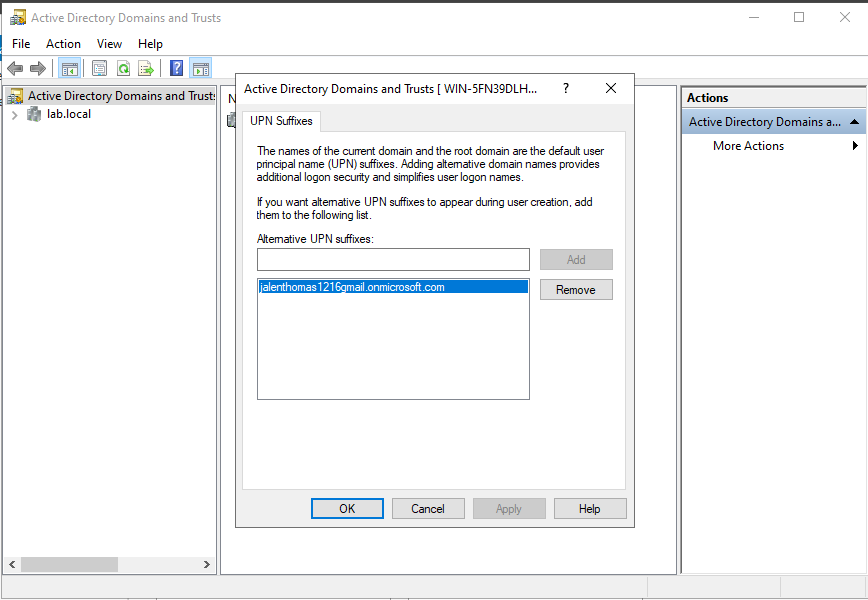
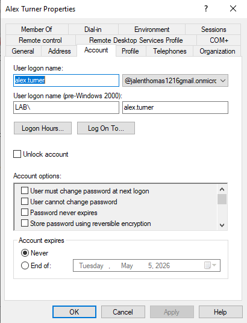
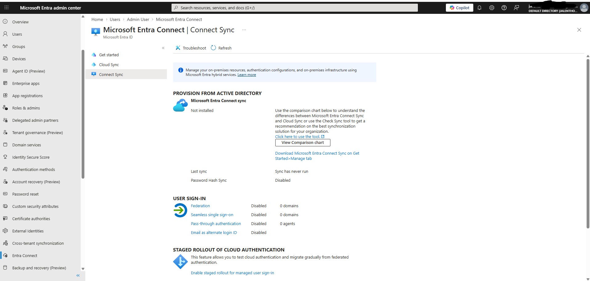
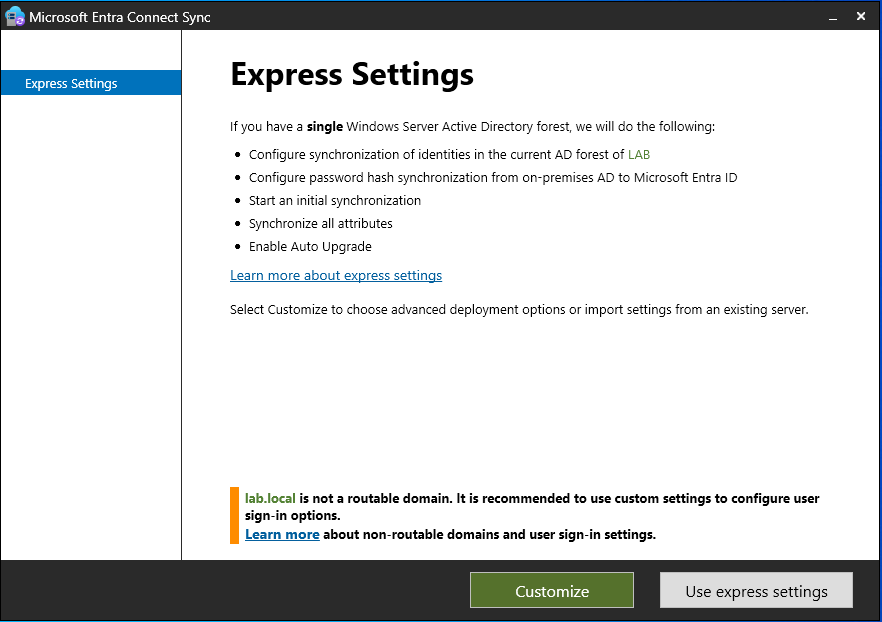
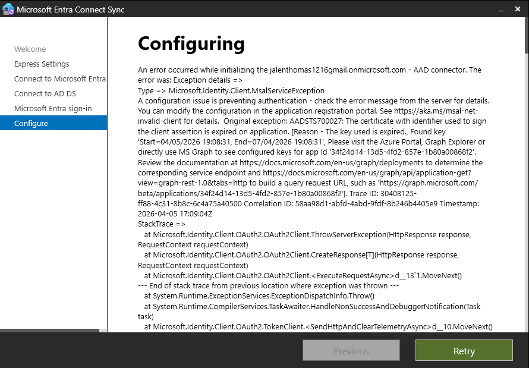

# Lab 11 — Microsoft Entra Connect (Hybrid Identity)

## Objective
Configure Microsoft Entra Connect to synchronize
on-premises Active Directory users to Microsoft Entra ID,
creating a hybrid identity environment that mirrors
real enterprise deployments.

## Environment
- On-premises: Windows Server 2022 · Domain: lab.local
- Cloud: Microsoft Entra ID Free tier
- Tool: Microsoft Entra Connect Sync
- Network: VirtualBox with NAT adapter for internet access

## What I did

### Step 1 — Domain preparation
- Opened Active Directory Domains and Trusts
- Added jalenthomas1216gmail.onmicrosoft.com as an
  alternative UPN suffix on the lab.local domain
- This is required because lab.local is not internet
  routable and cannot be used for cloud authentication

### Step 2 — Updated user UPN suffixes
- Opened each user in ADUC → Account tab
- Changed UPN suffix from @lab.local to
  @jalenthomas1216gmail.onmicrosoft.com for all 5 users:
  Alex Turner, Sara Nolan, Dan Reyes, Maria Gomez, James Park
- This ensures synced users can authenticate to Entra ID

### Step 3 — Downloaded Entra Connect
- Navigated to Microsoft Entra Admin Center
- Located Hybrid Management → Microsoft Entra Connect blade
- Note: As of March 2026 Microsoft moved the download
  from the Download Center to the Entra Admin Center directly

### Step 4 — Ran Express Settings installation
- Launched Microsoft Entra Connect Sync installer
- Selected Express Settings for simplified lab setup
- Authenticated with Entra ID admin credentials
- Authenticated with AD DS credentials (LAB\Administrator)

### Step 5 — Encountered certificate error
- During configuration received error: AADSTS700027
- Error message: The certificate used to sign the
  client assertion is expired
- The Entra Connect app registration certificate had
  expired on the free Entra ID tenant

## Error encountered
```
Type: Microsoft.Identity.Client.MsalServiceException
Error: AADSTS700027 - The certificate with identifier
used to sign the client assertion is expired.
App ID: 34f24d14-13d5-4fd2-857e-1b80a00868f2
Certificate valid: Start=04/05/2026, End=07/04/2026
```

## Troubleshooting research

**Root cause:** The service principal certificate used
by Entra Connect to authenticate to the tenant had expired.

**Resolution in production environment:**
1. Navigate to Entra ID → App registrations
2. Find the Entra Connect app registration
3. Go to Certificates and secrets
4. Upload a new certificate or generate a new one
5. Update the Entra Connect configuration with new cert

**Alternative resolution:**
- Delete and recreate the Entra Connect app registration
- Reinstall Entra Connect with a fresh configuration
- Upgrade to Entra ID P1/P2 for full support

## What I learned
- UPN suffixes must match a verified domain in Entra ID
  for users to authenticate after sync
- lab.local is a non-routable domain — real enterprises
  use routable domains like company.com
- Entra Connect moved from Microsoft Download Center to
  the Entra Admin Center as of early 2026
- Certificate expiration on app registrations is a
  common real-world IAM issue that causes sync failures
- AADSTS700027 is a well-known error code IAM analysts
  encounter in production environments
- Troubleshooting sync errors requires checking both
  the Entra portal and the local Entra Connect logs

## Why this matters on the job
- Most enterprises run hybrid identity with Entra Connect
- Sync failures are one of the most common IAM incidents
- Understanding UPN suffixes and routable domains is
  essential for hybrid identity design
- Certificate management for app registrations is a
  core IAM responsibility
- Knowing error codes like AADSTS700027 shows real
  production knowledge

## Skills demonstrated
- Hybrid identity architecture and planning
- UPN suffix configuration in Active Directory
- Microsoft Entra Connect installation and configuration
- Enterprise troubleshooting methodology
- Error code research and documentation
- App registration certificate management concepts

## Tools used
- Active Directory Domains and Trusts
- Active Directory Users and Computers
- Microsoft Entra Connect Sync
- Microsoft Entra Admin Center
- Windows Server 2022

## Screenshots





