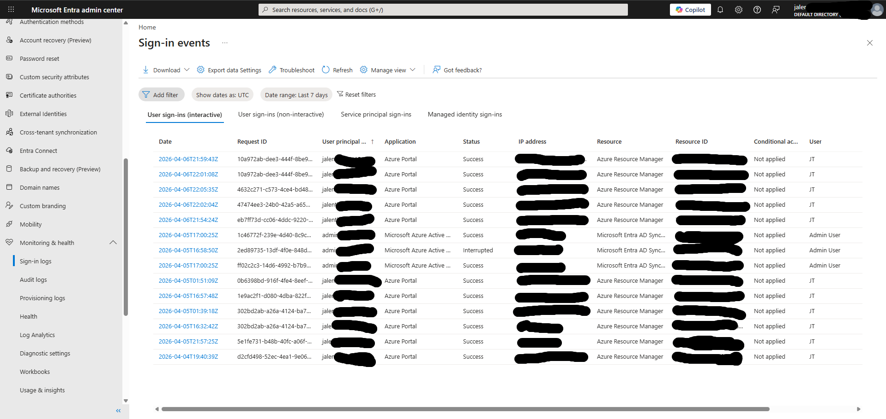
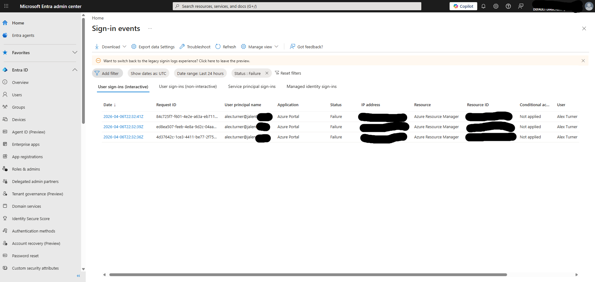
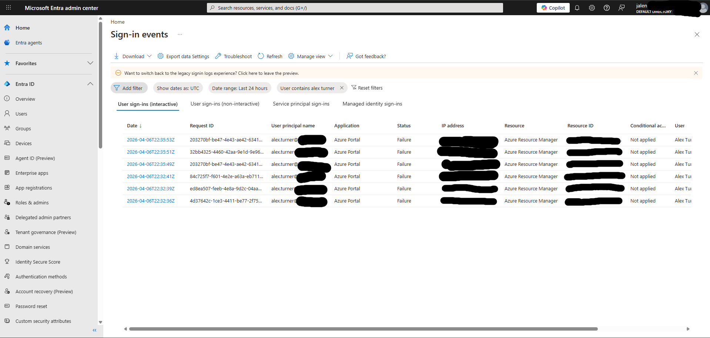
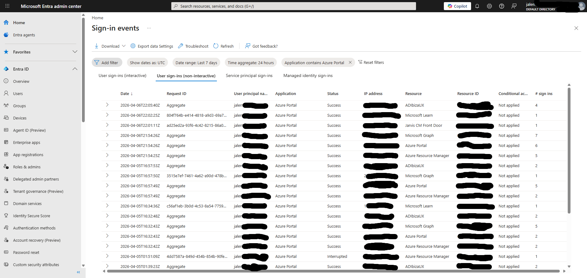

# Lab 12 — KQL & Sign-in Log Analysis in Entra ID

## Objective
Use Entra ID Sign-in logs to analyze authentication 
events, identify failed logins, filter by user and 
application, and practice the log analysis skills 
used daily by IAM analysts and SOC teams.

## Environment
- Microsoft Entra ID Free tier
- Entra ID Sign-in logs (real tenant data)
- Tenant: jalenthomas1216gmail.onmicrosoft.com

## What I did

### Query 1 — All sign-ins last 7 days
- Filtered Sign-in logs to last 7 days
- Reviewed all interactive user sign-ins
- Identified Success, Interrupted, and Failure events
- Observed sign-ins from multiple IP addresses 
  and applications

### Query 2 — Failed sign-ins
- Applied Status filter set to Failure
- Deliberately triggered failed logins to generate data
- Confirmed failed attempts appear in logs immediately
- Observed how failed logins are tracked per user

### Query 3 — Filter by specific user
- Filtered logs by user alex.turner
- Reviewed full sign-in history for that account
- Confirmed MFA events and application access patterns

### Query 4 — Filter by application
- Filtered non-interactive sign-ins by Azure Portal
- Discovered Microsoft Graph calls appear in 
  non-interactive logs under Resource column
- Identified background token refresh events
- Confirmed Interrupted events from Entra Connect attempt

## What I observed
- Sign-in logs are split into four categories:
  Interactive, Non-interactive, Service principal, 
  Managed identity
- Microsoft Graph API calls appear in non-interactive 
  logs not interactive logs
- Failed logins appear in logs immediately and show 
  the exact error reason
- Interrupted status means authentication started 
  but was not completed
- IP addresses appear in logs and can be used to 
  identify suspicious sign-in locations
- Conditional Access column shows Not applied on 
  free tier — would show policy name on P1/P2

## Why this matters on the job
- IAM analysts review sign-in logs daily to detect 
  suspicious activity
- Filtering by user is how you investigate a 
  compromised account
- Filtering by application shows what resources 
  are being accessed
- Failed login patterns can indicate brute force attacks
- Non-interactive logs reveal background service activity
- This is the same data SOC analysts use in Sentinel

## Skills demonstrated
- Entra ID Sign-in log navigation
- Log filtering by status, user, and application
- Interactive vs non-interactive sign-in analysis
- Failed login investigation
- Security event pattern recognition
- IP address analysis and redaction for security

## Tools used
- Microsoft Entra ID Admin Center
- Sign-in logs (Interactive and Non-interactive)
- Add filter functionality

## Screenshots

