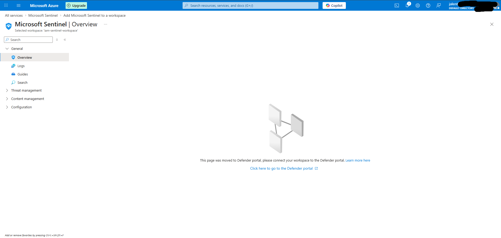
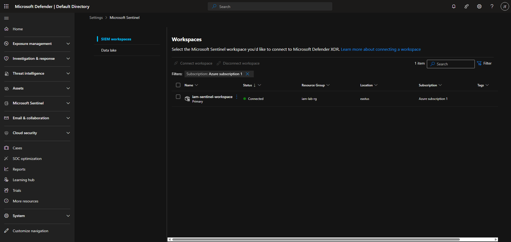
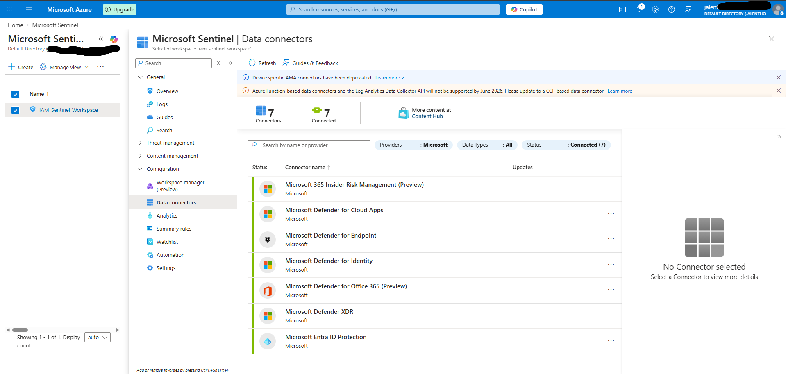
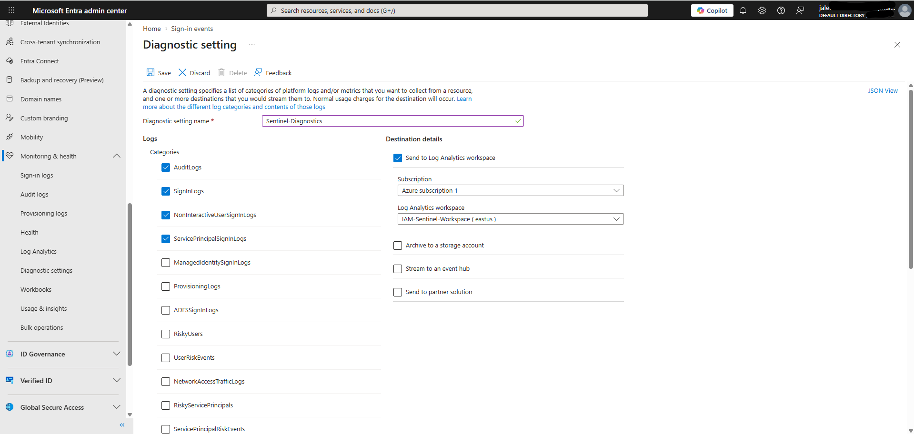
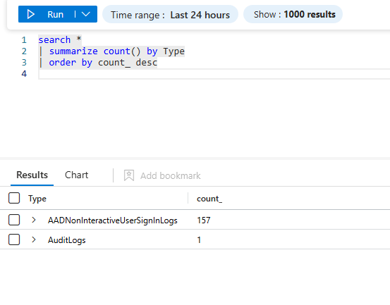
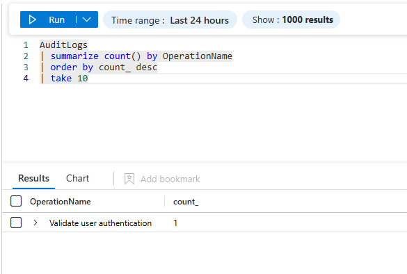
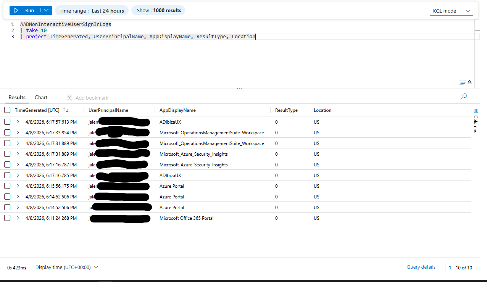
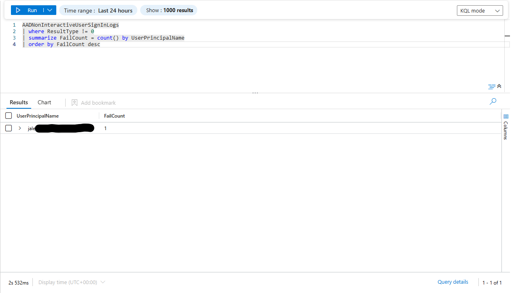
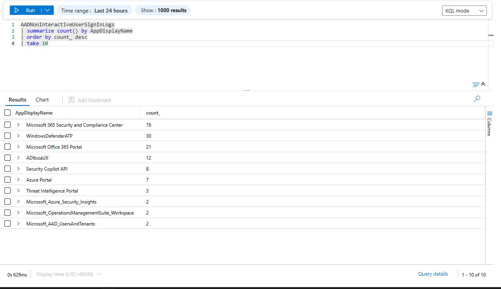
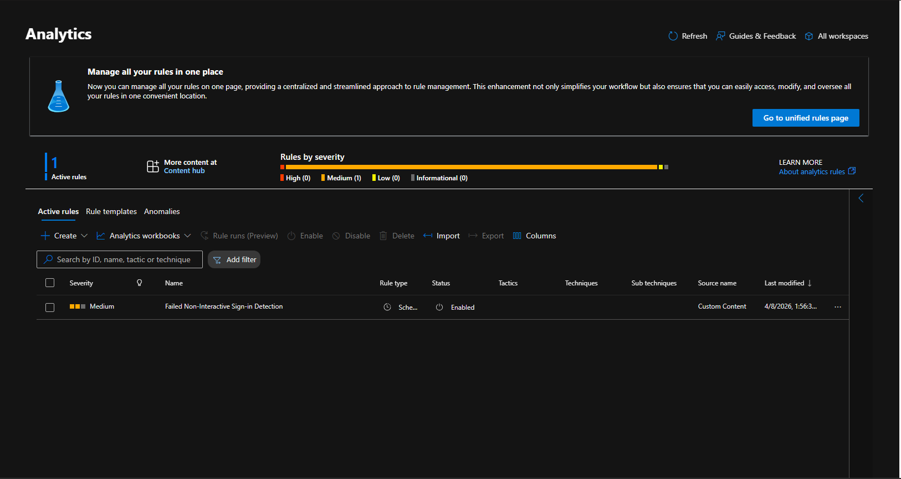

# Lab 14 — Microsoft Sentinel (SIEM)

## Objective
Deploy and configure Microsoft Sentinel as a cloud SIEM,
connect Microsoft Entra ID logs, write KQL queries to
analyze authentication events, and create an analytics
rule to detect suspicious sign-in activity.

## Environment
- Microsoft Sentinel workspace: IAM-Sentinel-Workspace
- Resource group: IAM-Lab-RG
- Region: East US
- Subscription: Azure subscription 1
- Connected to: Microsoft Entra ID tenant

## What I did

### Part 1 — Workspace setup
- Created Log Analytics workspace in Azure Portal
- Deployed Microsoft Sentinel to the workspace
- Connected workspace to Microsoft Defender XDR portal
- Assigned Microsoft Sentinel Contributor role to admin account
- Verified 7 data connectors showing as connected

### Part 2 — Data connector configuration
- Navigated to Data Connectors in Sentinel
- Installed Microsoft Entra ID solution from Content Hub
- Configured diagnostic settings in Entra ID to stream:
  - AuditLogs
  - SignInLogs
  - NonInteractiveUserSignInLogs
  - ServicePrincipalSignInLogs
- Resolved diagnostic setting conflict with auto-created
  AzureSentinel connector
- Confirmed data flowing into two tables:
  - AuditLogs
  - AADNonInteractiveUserSignInLogs

### Part 3 — KQL queries
Wrote and executed 5 KQL queries against real Entra ID data:
- Queried audit log activity with project operator
- Summarized audit events by operation type
- Retrieved non-interactive sign-in events
- Identified failed non-interactive sign-ins
- Analyzed sign-ins grouped by application

### Part 4 — Analytics rule
Created a scheduled analytics rule to detect suspicious
failed sign-in patterns:
- Rule name: Failed Non-Interactive Sign-in Detection
- Severity: Medium
- Query runs every 5 minutes
- Looks back 1 hour of data
- Triggers when a user has more than 3 failed sign-ins

## KQL queries used

### Check available tables
```kql
search *
| summarize count() by $table
| order by count_ desc
```

### Audit log activity
```kql
AuditLogs
| take 10
| project TimeGenerated, OperationName, Result,
  InitiatedBy, TargetResources
```

### Audit events by operation
```kql
AuditLogs
| summarize count() by OperationName
| order by count_ desc
| take 10
```

### Non-interactive sign-ins
```kql
AADNonInteractiveUserSignInLogs
| take 10
| project TimeGenerated, UserPrincipalName,
  AppDisplayName, ResultType, Location
```

### Failed sign-in detection rule
```kql
AADNonInteractiveUserSignInLogs
| where ResultType != 0
| summarize FailCount = count() by UserPrincipalName, AppDisplayName
| where FailCount > 3
```

### Sign-ins by application
```kql
AADNonInteractiveUserSignInLogs
| summarize count() by AppDisplayName
| order by count_ desc
| take 10
```

## What I observed
- Sentinel auto-creates a diagnostic setting when deployed
  but does not check any log types by default
- AuditLogs and AADNonInteractiveUserSignInLogs were the
  first tables to receive data from Entra ID free tier
- SignInLogs requires Entra ID P1/P2 license to export
- KQL project operator selects specific columns
- KQL summarize operator groups and counts events
- Analytics rules run on a schedule and create incidents
  when query results match threshold conditions
- The Defender portal is now the primary Sentinel interface
  as Microsoft merged XDR and SIEM into one platform

## Why this matters on the job
- Sentinel is the most widely deployed cloud SIEM in
  enterprise Microsoft environments
- IAM analysts use KQL daily to investigate identity events
- Analytics rules automate threat detection at scale
- Understanding how to connect identity logs to a SIEM
  is a core IAM and SOC analyst skill
- Failed sign-in detection is one of the most common
  use cases for identity-based threat detection

## Skills demonstrated
- Microsoft Sentinel deployment and configuration
- Log Analytics workspace management
- Data connector configuration
- Diagnostic settings management
- KQL query writing and execution
- SIEM analytics rule creation
- Identity log analysis
- Threat detection rule design

## Tools used
- Microsoft Sentinel
- Microsoft Defender XDR portal
- Azure Portal
- Log Analytics
- KQL (Kusto Query Language)
- Microsoft Entra ID

## Screenshots










