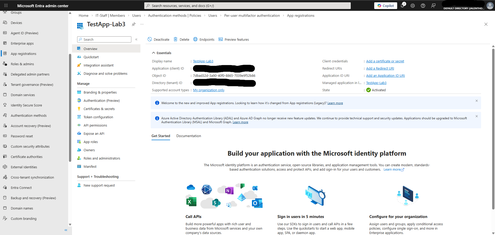
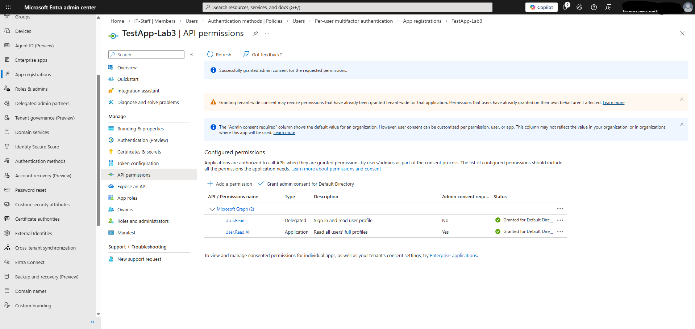
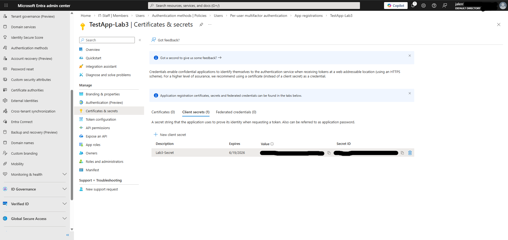

# Lab 3 — App Registrations in Entra ID

## Objective
Register an application in Microsoft Entra ID and configure 
API permissions and credentials to simulate how enterprise 
applications authenticate to Azure AD.

## Environment
- Microsoft Entra ID Free tier
- Personal lab tenant: jalenthomas1216gmail.onmicrosoft.com

## What I did

### App registration
- Created a new app registration called TestApp-Lab3
- Configured as single tenant only
- Noted the Application (client) ID and Tenant ID

### API permissions
- Added User.Read as a delegated permission
- Added User.Read.All as an application permission
- Granted admin consent for both permissions

### Client secret
- Created a client secret called Lab3-Secret
- Set expiry to 90 days
- Noted that the secret value is only visible once after creation

## What I observed
- Application (client) ID acts as the app's username
- Client secret acts as the app's password
- Delegated permissions allow the app to act on behalf 
  of a signed-in user
- Application permissions allow the app to act as itself 
  with no user involved
- Admin consent is required before an app can access tenant data
- Client secrets have expiry dates — expired secrets are a 
  common security gap found during IAM audits

## Why this matters on the job
- IAM analysts regularly audit app registrations to check 
  what permissions apps have been granted
- Expired or overprivileged secrets are a major security risk
- Understanding delegated vs application permissions is 
  one of the most common IAM interview topics
- Admin consent approvals should be reviewed regularly 
  to ensure no apps have excessive permissions

## Skills demonstrated
- Application registration in Entra ID
- API permission configuration
- Delegated vs application permission types
- Admin consent management
- Client secret creation and management
- App identity concepts (client ID, tenant ID, secret)

## Tools used
- Microsoft Entra ID
- Microsoft Graph API permissions

## Screenshots

