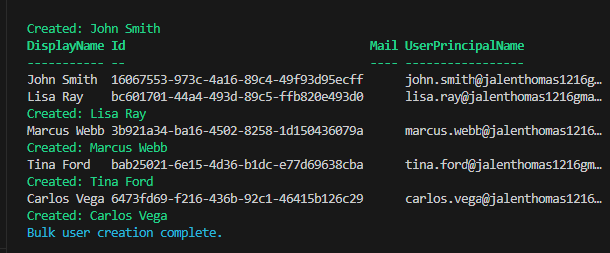
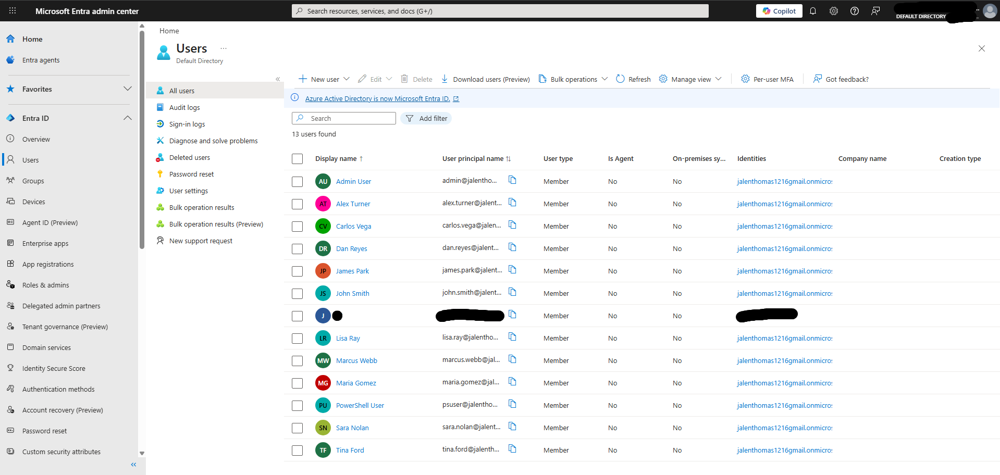

# Lab 5 — Bulk User Creation via PowerShell & CSV

## Objective
Automate the creation of multiple users in Microsoft 
Entra ID using a CSV file and PowerShell, simulating 
real enterprise employee onboarding workflows.

## Environment
- Microsoft Entra ID Free tier
- PowerShell 7.6.0
- Microsoft Graph PowerShell SDK
- Visual Studio Code

## What I did
- Created a CSV file with 5 users including Department 
  and Job Title attributes
- Wrote a PowerShell script to read the CSV and create 
  each user automatically
- Used try/catch error handling to log successes and failures
- Confirmed all 5 users were created in Entra ID portal

## What I observed
- CSV-based onboarding eliminates manual portal work
- Try/catch blocks allow the script to continue even 
  if one user fails
- Department and Job Title are set automatically 
  from the CSV — no extra steps needed
- This is how IAM teams onboard entire departments 
  at once during mergers or large hiring events

## Script used
```powershell
Connect-MgGraph -Scopes "User.ReadWrite.All"

Import-Csv -Path "$env:USERPROFILE\Desktop\users.csv" | ForEach-Object {
    $pp = @{ 
        Password = "TempPass123!"
        ForceChangePasswordNextSignIn = $true 
    }
    try {
        New-MgUser `
            -DisplayName $_.DisplayName `
            -UserPrincipalName $_.UserPrincipalName `
            -Department $_.Department `
            -JobTitle $_.JobTitle `
            -MailNickname $_.MailNickname `
            -AccountEnabled `
            -PasswordProfile $pp
        Write-Host "Created: $($_.DisplayName)" -ForegroundColor Green
    } catch {
        Write-Host "Failed: $($_.DisplayName)" -ForegroundColor Red
    }
}
```

## Skills demonstrated
- PowerShell scripting
- CSV data processing
- Bulk user provisioning automation
- Error handling in PowerShell
- Microsoft Graph API user management
- Enterprise onboarding simulation

## Tools used
- PowerShell 7.6.0
- Microsoft Graph PowerShell SDK
- Visual Studio Code
- Microsoft Entra ID

## Screenshots


