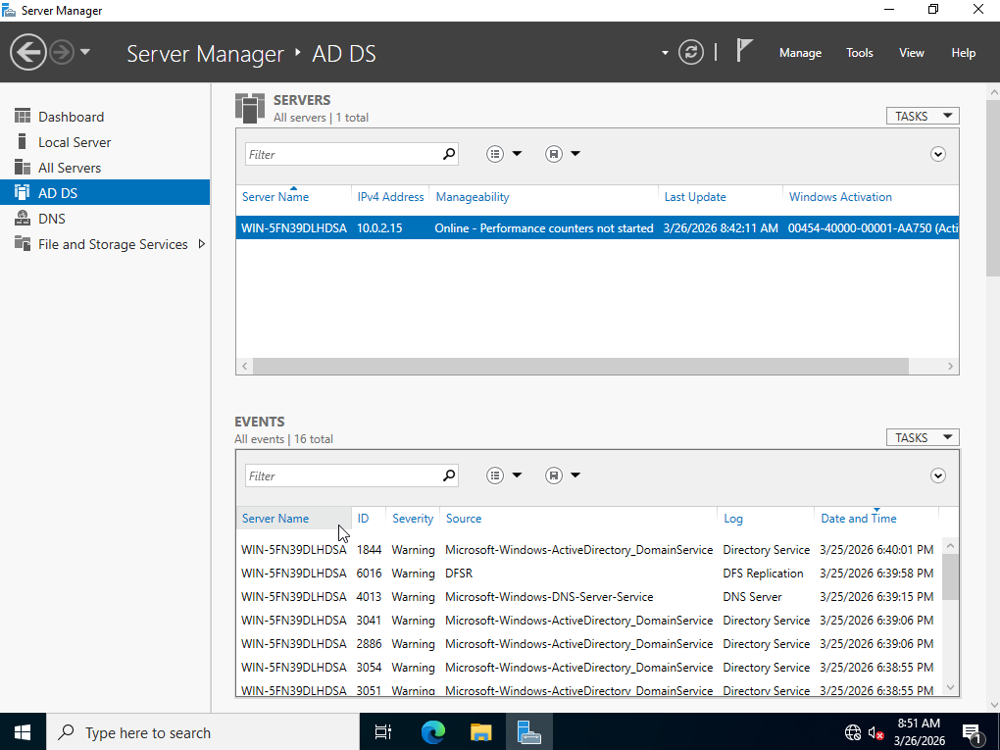
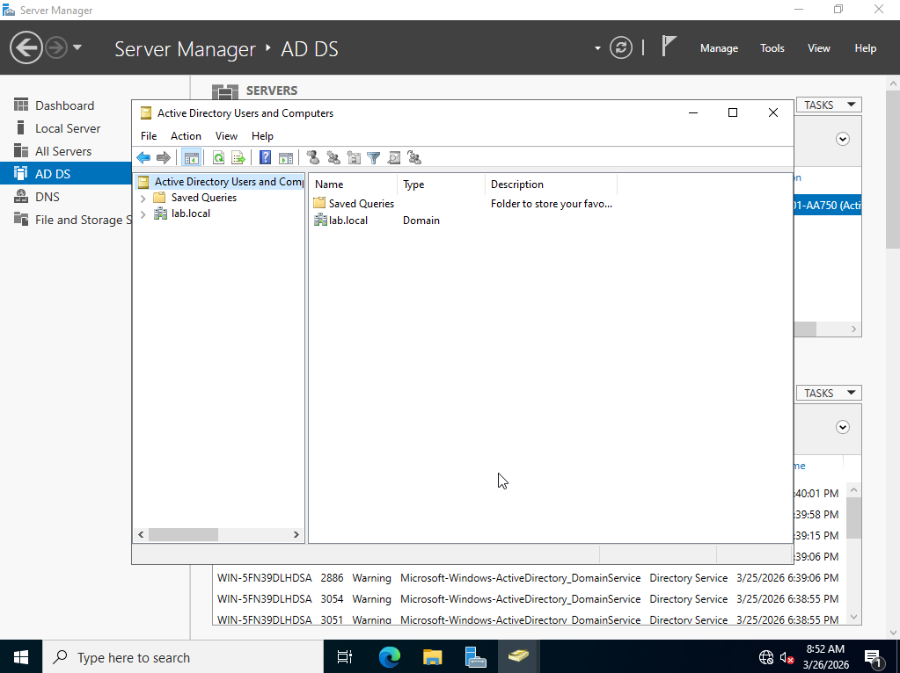
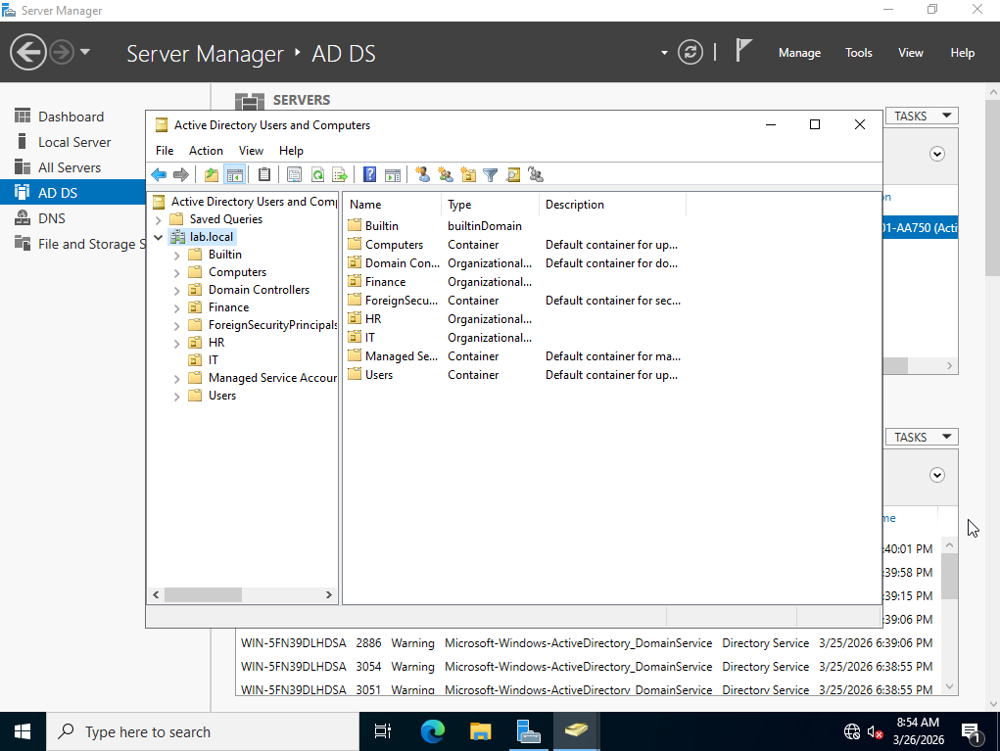

# Lab 6 — Active Directory Domain Controller Setup

## Objective
Install and configure an Active Directory Domain Controller 
on Windows Server 2022 inside VirtualBox, simulating a real 
enterprise on-premises AD environment.

## Environment
- Hypervisor: VirtualBox
- OS: Windows Server 2022 Standard Evaluation (Desktop Experience)
- RAM: 8192 MB | CPUs: 4 | Disk: 60GB
- Domain: lab.local
- NetBIOS name: LAB

## What I did

### Virtual Machine setup
- Downloaded VirtualBox and Windows Server 2022 Evaluation ISO
- Created VM with 8GB RAM, 4 CPUs, 60GB virtual disk
- Booted from ISO and selected Desktop Experience edition
- Set Administrator password and completed Windows installation

### Active Directory installation
- Opened Server Manager
- Added the Active Directory Domain Services role
- Promoted server to Domain Controller
- Created new forest with root domain: lab.local
- Set DSRM password for recovery purposes
- Server restarted and joined the domain automatically

### Verification
- Logged back in as LAB\Administrator
- Opened Active Directory Users and Computers
- Confirmed lab.local domain visible with default containers:
  Builtin, Computers, Domain Controllers, Users

## What I observed
- AD DS role must be installed before promotion to DC
- Creating a new forest establishes the root domain
- After promotion the login changes from local to domain account
- Default containers are created automatically by AD

## Why this matters on the job
- Most enterprise environments still run on-prem AD
- IAM analysts manage user accounts and access in ADUC daily
- Domain Controllers are the backbone of enterprise identity
- Understanding AD structure is required for almost every IAM role

## Skills demonstrated
- VirtualBox VM creation and configuration
- Windows Server 2022 installation
- Active Directory Domain Services installation
- Domain Controller promotion
- New forest and domain creation
- ADUC navigation and verification

## Tools used
- VirtualBox
- Windows Server 2022 Standard Evaluation
- Server Manager
- Active Directory Users and Computers (ADUC)

## Screenshots

