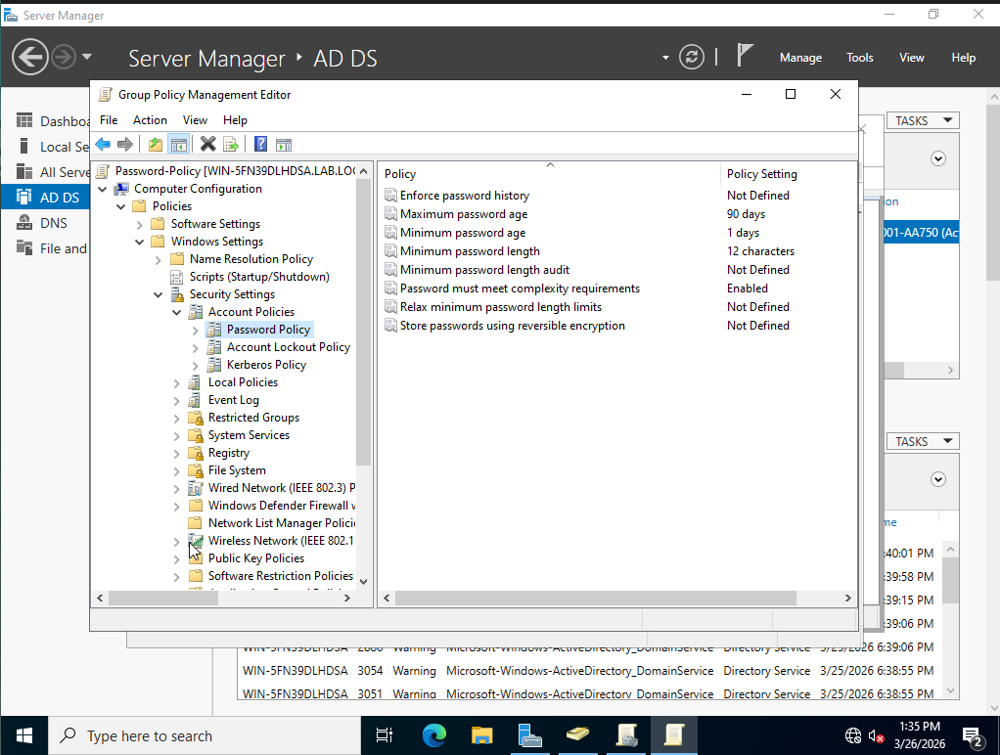
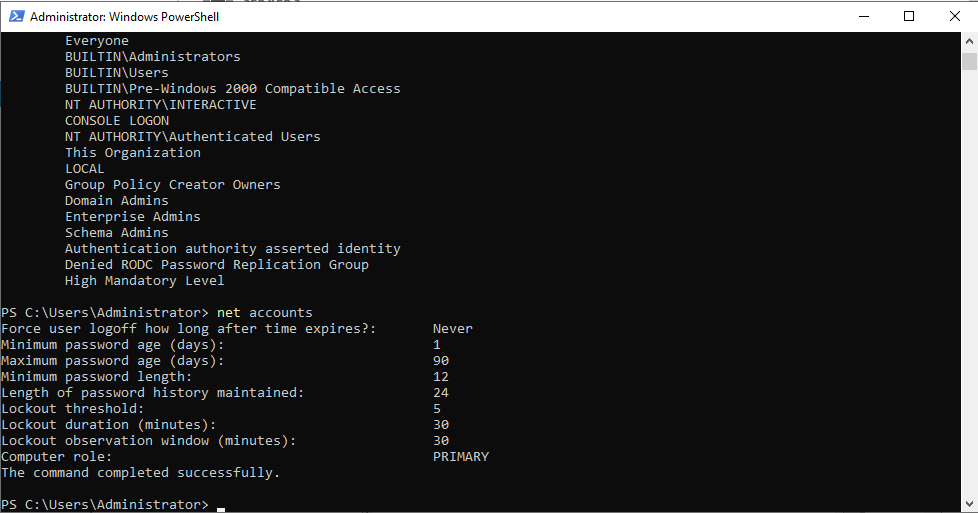

# Lab 8 — Group Policy Objects (GPO)

## Objective
Create and configure Group Policy Objects in Active Directory 
to enforce password policies and desktop security settings 
across the lab.local domain.

## Environment
- Windows Server 2022 Standard Evaluation
- Active Directory Domain: lab.local
- Group Policy Management Console

## What I did

### GPO 1 — Password Policy
- Created Password-Policy GPO linked to lab.local
- Set minimum password length to 12 characters
- Set maximum password age to 90 days
- Enabled password complexity requirements
- Set account lockout threshold to 5 invalid attempts
- Set lockout duration to 30 minutes

### GPO 2 — Desktop Lockout
- Created Desktop-Lockout GPO linked to lab.local
- Set machine inactivity limit to 600 seconds (10 minutes)

### Verification
- Ran gpupdate /force to apply policies immediately
- Ran net accounts to confirm password policy settings applied
- Confirmed minimum password length: 12
- Confirmed lockout threshold: 5

## What I observed
- Password policies in AD must be configured in the 
  Default Domain Policy to take effect at domain level
- Custom GPOs linked to OUs do not override domain-level 
  password policies — this is a common misconception
- gpupdate /force immediately applies policy changes 
  without waiting for the default refresh interval
- net accounts command shows current domain password 
  and lockout policy settings

## Why this matters on the job
- IAM analysts configure and audit GPOs regularly
- Password policies are a core security control in every org
- Understanding Default Domain Policy vs custom GPO 
  precedence is a common interview topic
- gpupdate and gpresult are daily tools for IAM and sysadmin

## Skills demonstrated
- Group Policy Management Console navigation
- GPO creation and linking
- Password policy configuration
- Account lockout policy configuration
- GPO verification using gpupdate and net accounts
- Understanding of GPO precedence and inheritance

## Tools used
- Group Policy Management Console
- Windows Server 2022
- Command Prompt (gpupdate, net accounts)

## Screenshots

