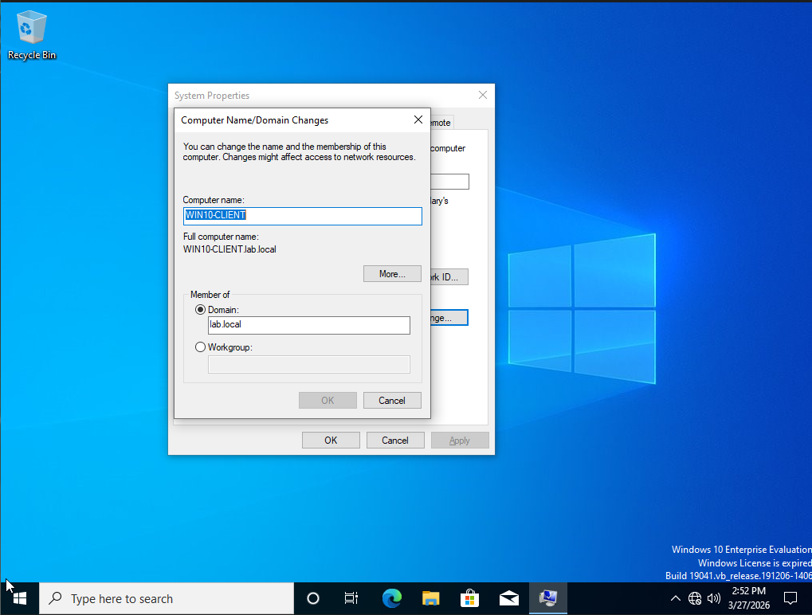
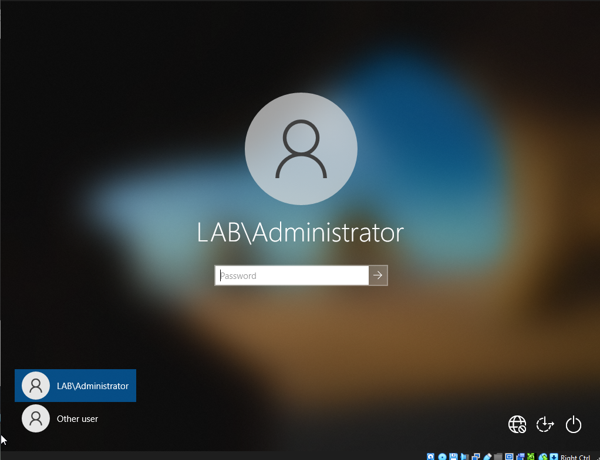
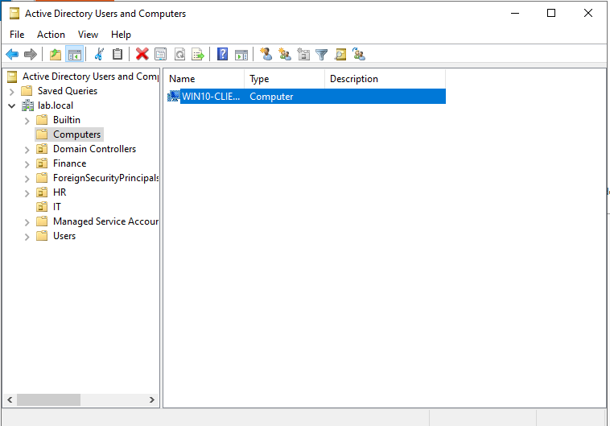

# Lab 9 — Join Windows 10 Client to Active Directory Domain

## Objective
Join a Windows 10 Enterprise client machine to the lab.local 
Active Directory domain, simulating a real enterprise 
workstation deployment.

## Environment
- Domain Controller: Windows Server 2022 (192.168.1.1)
- Client Machine: Windows 10 Enterprise (192.168.1.2)
- Domain: lab.local
- Network: VirtualBox Internal Network (lab-network)
- Hypervisor: VirtualBox

## What I did

### Network configuration
- Set Server static IP to 192.168.1.1
- Set Client static IP to 192.168.1.2
- Set Client DNS to point to Server at 192.168.1.1
- Verified connectivity with ping between both VMs
- Configured Server with two adapters:
  - Internal Network for client communication
  - NAT for internet access

### Domain join
- Opened System Properties on Windows 10 client
- Selected Domain membership and entered lab.local
- Authenticated with LAB\Administrator credentials
- Received "Welcome to the lab.local domain" message
- Restarted the client machine

### Verification
- Logged into Windows 10 as LAB\Administrator
- Logged in as domain user LAB\alex.turner
- Confirmed WIN10-CLIENT appears in ADUC Computers container
- Confirmed GPOs are applying to the client machine

## What I observed
- Windows 10 Home does not support domain joining
- Windows 10 Enterprise is required for domain membership
- DNS must point to the Domain Controller for domain join to work
- A typo in the DNS IP address caused initial failure
- After domain join all domain users can log into the client
- The computer account automatically appears in ADUC

## Why this matters on the job
- IAM analysts regularly provision and troubleshoot 
  domain-joined workstations
- DNS misconfiguration is one of the most common causes 
  of domain join failures
- Understanding how GPOs apply to client machines is 
  essential for IAM and sysadmin roles
- Computer accounts in AD are managed just like user accounts

## Skills demonstrated
- Static IP configuration on Windows client
- DNS configuration for domain resolution
- Domain join process via System Properties
- Domain user authentication on client machine
- ADUC computer account verification
- Network troubleshooting with ping and nslookup

## Tools used
- Windows 10 Enterprise
- Windows Server 2022
- Active Directory Users and Computers
- Command Prompt (ping, nslookup, ipconfig)
- VirtualBox Internal Network

## Screenshots

